# Automatic-Plant-Watering-System
## Abstract
This project presents the development of an Automated Plant Monitoring System designed to optimize energy usage and ensure effective irrigation. The system harnesses renewable solar energy, employing a 12V solar panel as the primary power source. A current sensor monitors the charging current for a lead-acid battery, ensuring safe and efficient operation. An MPPT (Maximum Power Point Tracking) controller regulates the solar panel's output, dynamically adjusting a connected buck converter's PWM input to implement the three-stage charging process critical for lead-acid batteries.
A secondary buck converter steps down the battery voltage to 5V to power the Arduino-based MPPT controller. This controller integrates three soil moisture sensors and three relay-controlled water pumps to automate irrigation based on soil conditions. The system efficiently manages energy distribution and enhances plant care, combining renewable energy utilization with precise moisture monitoring and irrigation control. This solution is suitable for sustainable agricultural applications, reducing manual intervention while optimizing energy and water resources

## Introduction
The need for sustainable and efficient agricultural systems has never been more critical as the global demand for food continues to grow. Automated plant monitoring and irrigation systems offer a solution by optimizing resource utilization and reducing manual labor. This project introduces an Automated Plant Monitoring System that combines renewable energy, smart sensors, and automated control to monitor and maintain soil moisture levels effectively
The system harnesses solar energy as its primary power source, utilizing a 12V solar panel and a lead-acid battery for energy storage. An integrated Maximum Power Point Tracking (MPPT) controller ensures maximum energy extraction from the solar panel under varying environmental conditions. The MPPT controller also manages the three-stage charging process of the battery, ensuring its longevity and safe operation
Connected to the controller are three soil moisture sensors and three relay-controlled water pumps. The sensors continuously monitor soil moisture levels, providing real-time feedback to the system. When the soil moisture falls below a specified threshold, the corresponding pump is activated via a relay module to irrigate the plants.
This project demonstrates the integration of renewable energy, smart monitoring, and automated irrigation in a cost-effective and scalable system. It is designed for small-scale farming, gardens, and other agricultural applications, emphasizing sustainability and energy efficiency.

## Block Diagram

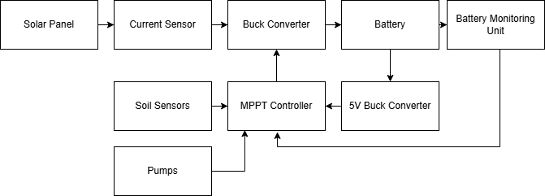

## Components Used
### BOM

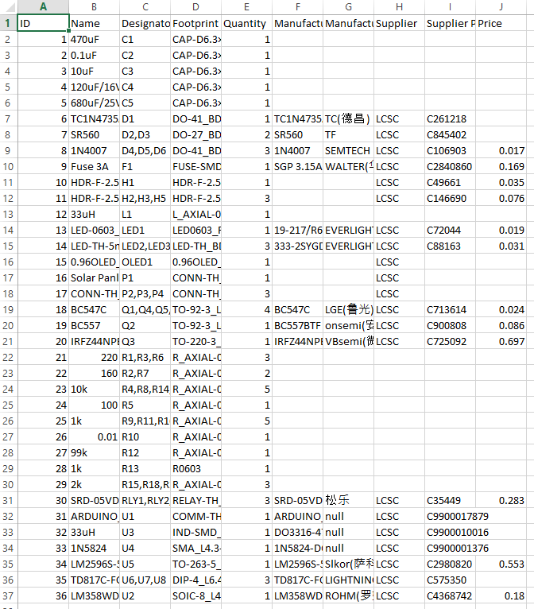

## Circuit Design
### Schematic

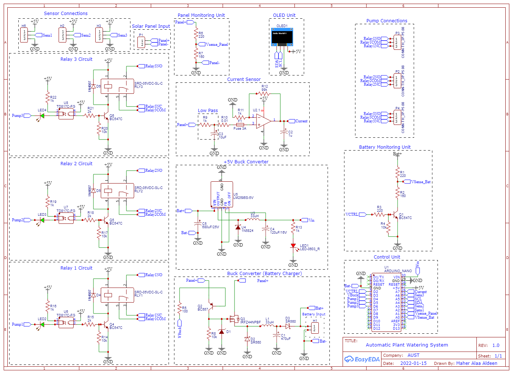

### Step-By-Step Circuit Analysis
#### Solar Panel Input

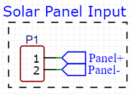

- Two Wires connects the +12V Solar Panel to the Designed System.

 #### Current Sensor Design

 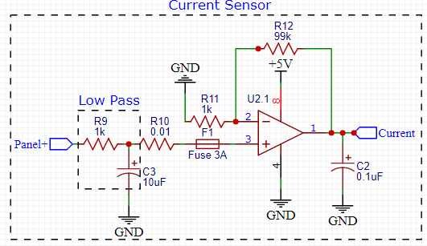

 - A shunt resistor method is used to measure the current from the solar panel.
 - A maximum current of 5A can be extracted from the solar panel when charging.
 - A 0.01 ohm resistor is used.
 - Since arduino can only read voltage:
 - - v = i x r ==> v = 5 x 0.01 = 0.05v.
   - The arduino can't read this small amount, so we have to amplify it.
   - A Non-Inverting Amplifier (LM358) with Gain 100 is designed with Rf = 99kohm and Ri = 1kohm.
- The power dissipated: P = I x I x R = 25 x 0.01  = 25W
- To eliminate external noise from the circuit input, a passive low-pass filter is designed:
- - fc = 1 / (2pi x Rshunt x Cin) = 1 / (2pi x 0.01 x 10uF) = 1.6 KHz.
- A 0.01uF capacitor is connected to the output of the sensor to filter out noise from the Amplifier. 

#### Buck Converter Design for Charging the Battery

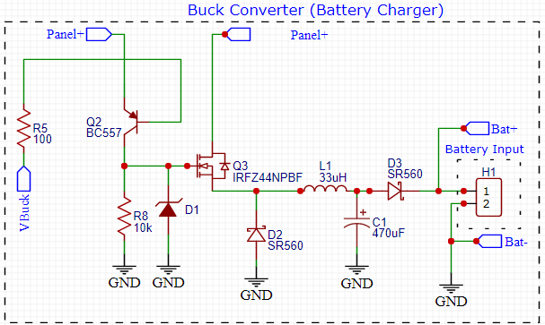

##### Charging Modes for Lead-Acid Battery:
Charging a lead-acid battery involves three distinct phases:
1. Bulk Charge (Constant Current Mode):
- - In this phase, the battery is charged at a constant current until the voltage reaches the absorption voltage level (usually around 14.4V to 14.8V for a 12V battery).
  - This is the fastest charging phase and replenishes most of the battery's capacity.
  - Current is the primary focus during this stage, while the voltage gradually rises.
2. Absorption Charge (Constant Voltage Mode):
- - Once the absorption voltage is reached, the charger maintains this voltage.
  - During this phase, the current gradually decreases as the battery becomes more fully charged.
  - This stage ensures the battery is charged safely without overcharging and allows the internal chemical reactions to stabilize.
3. Float Charge (Maintenance Mode):
- - After the battery is fully charged, the voltage is reduced to a lower level, typically around 13.2V to 13.8V, to prevent overcharging.
  - This phase compensates for the self-discharge of the battery and keeps it ready for use without damaging it.
  - It is ideal for batteries that remain connected to a charger for long periods.
##### Buck Converter (Charger):
1. Arduino PWM and BC557 Transistor Control:
- - The Arduino generates a PWM signal to control the buck converter.
  - A 100-ohm resistor is connected between the PWM output pin of the Arduino and the base of the BC557 (a PNP transistor).
  - The BC557 acts as a switch to regulate the power flow based on the PWM signal.
  - When the PWM signal is LOW, the BC557 transistor turns ON, allowing current to flow from the Panel+ terminal through the circuit.
2. MOSFET (IRFZ44NPBF) and Zener Diode:
- - The IRFZ44N MOSFET is the main switching component of the buck converter.
  - A 12V Zener diode connected to the MOSFET's gate ensures that the gate voltage stays within safe limits, protecting the MOSFET from excessive voltage.
  - The MOSFET switches ON and OFF rapidly, controlled by the Arduino's PWM signal passed through the BC557.
3. Schottky Diode and Inductor:
- - A Schottky diode is connected to the source terminal of the MOSFET to prevent backflow of current and ensure unidirectional energy transfer to the load.
  - The 33uH inductor is placed in series with the circuit to smooth the current flow and store energy during the OFF cycle of the MOSFET.
  - During the OFF phase, the inductor releases stored energy, ensuring a continuous flow of current to the battery.
4. Output Filtering;
- - A 470uF capacitor is connected after the inductor to filter out voltage ripples and stabilize the DC output voltage.
  - A second Schottky diode prevents reverse current from flowing back into the inductor or MOSFET, ensuring the battery is safely charged.
5. Battery Connection:
- - The output of the buck converter is directly connected to the terminals of the lead-acid battery.
  - The buck converter adjusts its output voltage and current to suit the battery's charging phase based on the Arduino's MPPT algorithm.

#### Panel Voltage Monitoring

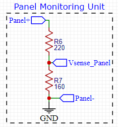

- A voltage divider ise configured to measure the voltage from the solar panel.
- Vsensed = Vsolar (R2 / R1 + R2).
- Vsensed = 12V (160/160+220) =  5V.
- if the arduino reads 5V, then the Panel is generating 12V.

#### Battery Monitor Unit

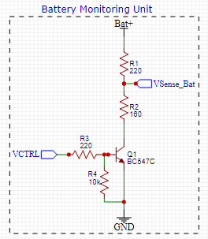

- The same voltage divider is configured as above.
- a Transistor switch is added, so that the user can choose when to read the battery's level.

#### 5V Buck Converter
- The 5V Buck converter is used to step down the the 12V from the battery to 5V to power up the arduino.
- Press the link below to see the full explanation.
[5V Buck converter](https://github.com/MaherAlaaDeen/PCB-Designs/blob/main/Project%208/README.md)

#### Soil Sensors Configuration

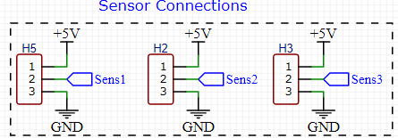

#### Relay Module

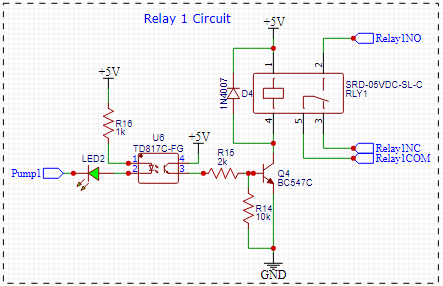

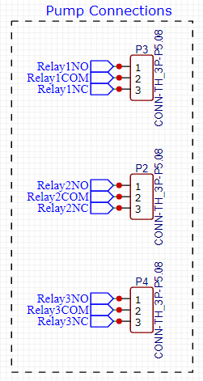

- The relay module is used to turn ON an associated pump to irrigate the plant.
- Press on the link below to see the full explanation.
- [Relay](https://github.com/MaherAlaaDeen/PCB-Designs/blob/main/Project%205/READMED.md)

#### OLED

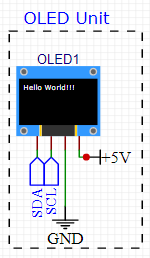

- The OLED is Embedded on the PCB in order to tell the user the Battery percentage during charging.

#### Control Unit

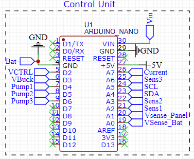

## PCB Design
### PCB Routing
#### Top Layer

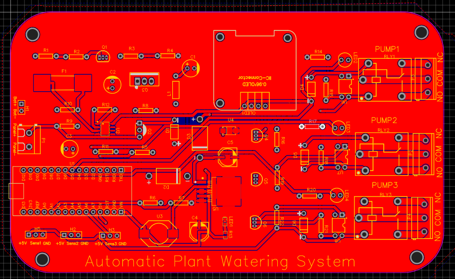

#### Bottom Layer

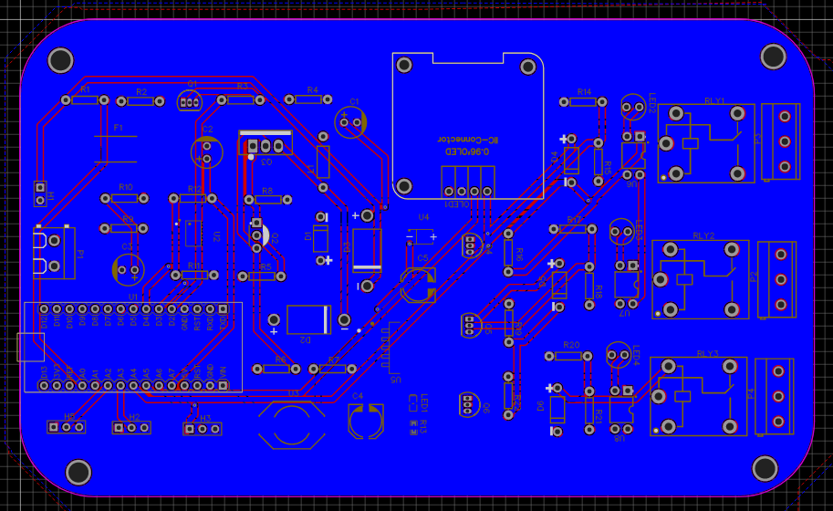

### PCB Layers
#### Top Layer

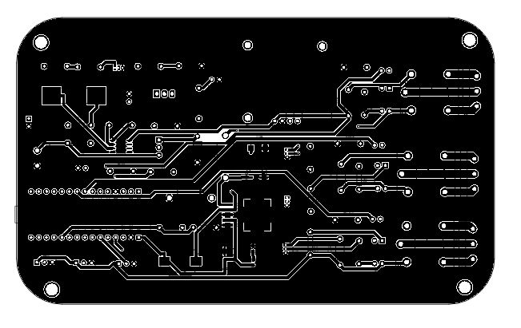

#### Bottom Layer

### PCB 3D View

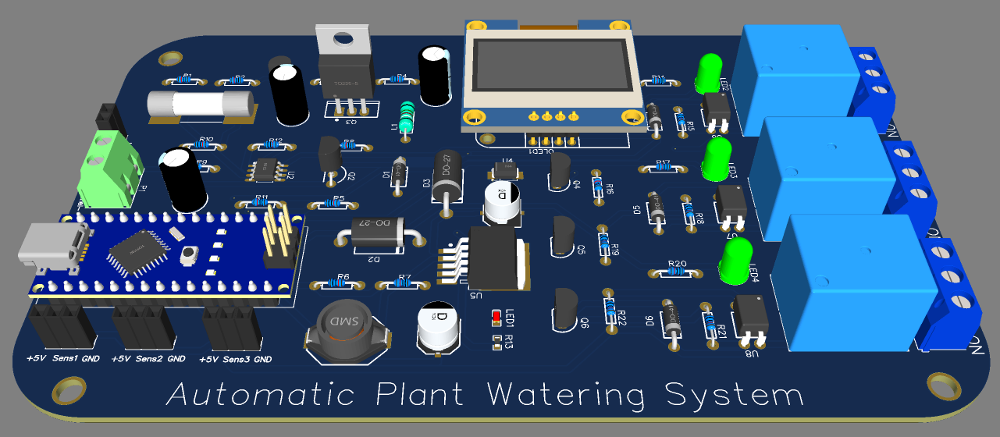
